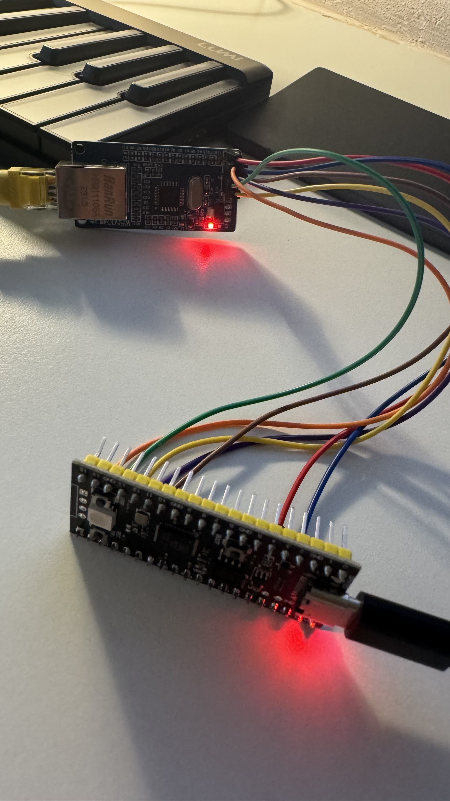

# Template for RP2040 + Ethernet + REST API Hanlders

Template for a REST API non-blocking WebServer app for Pico RP2040 and WizNet Ethernet modules (W5100, W5500)

## Features

This template features the follwing, with working sample code:

* Ethernet driver for WizNet modules (tested W5100/W5500)
* Non-blocking WebServer
* REST API handler
* JSON serialiser

## Recommended Wiring

Here's a basic pin mapping for connecting the RP2040 to the W5100/W5500 module:

| W5500 Pin  | RP2040 Pin | Description           |
|------------|------------|-----------------------|
| VCC        | 3.3V       | Power Supply          |
| GND        | GND        | Ground                |
| SCK        | GPIO18     | SPI Clock (SCK)       |
| MISO       | GPIO16     | SPI Master In Slave Out (MISO) |
| MOSI       | GPIO19     | SPI Master Out Slave In (MOSI) |
| CS         | GPIO17     | Chip Select (CS)      |
| RESET      | GPIO20     | Reset                 |
| INT        | Not Connected | Interrupt (optional)  |

## Actual Picture

